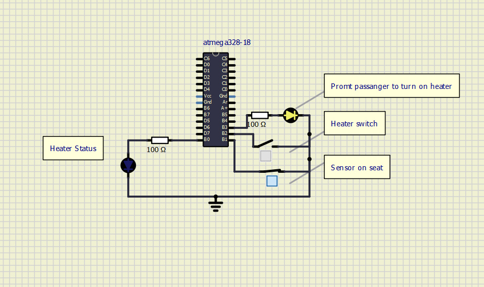
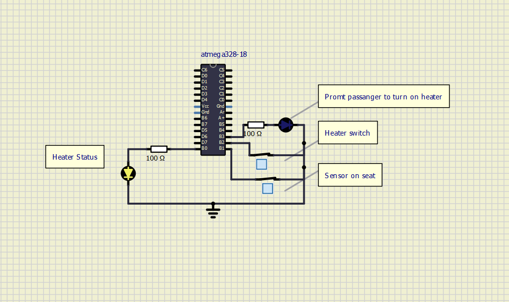

# ACTIVITY 1
- This is the code for promting and denoting about the status of car seat heater.

### In Action

|OFF|PROMT|ON|
|:--:|:--:|:--:|
||||

#### CI and Code Quality

|Build|Cppcheck|Codacy|
|:--:|:--:|:--:|
||||

