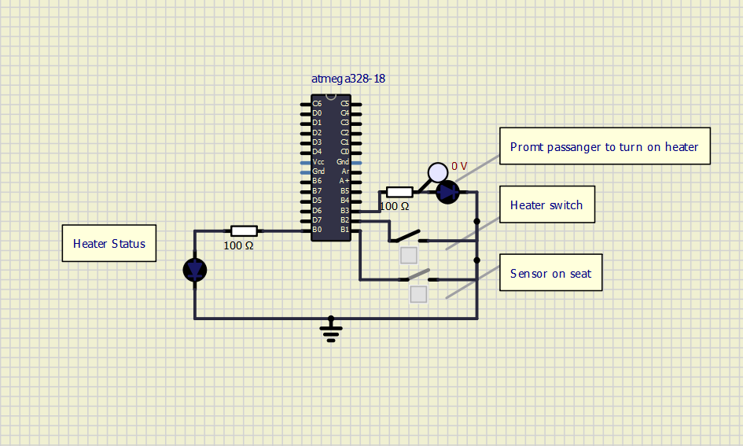
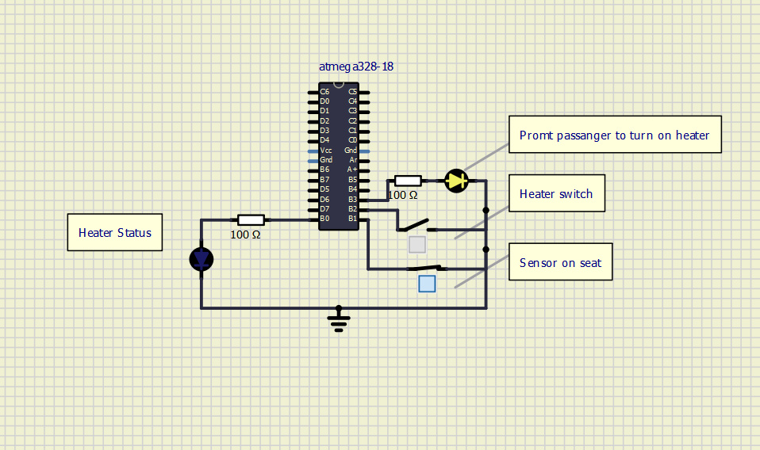
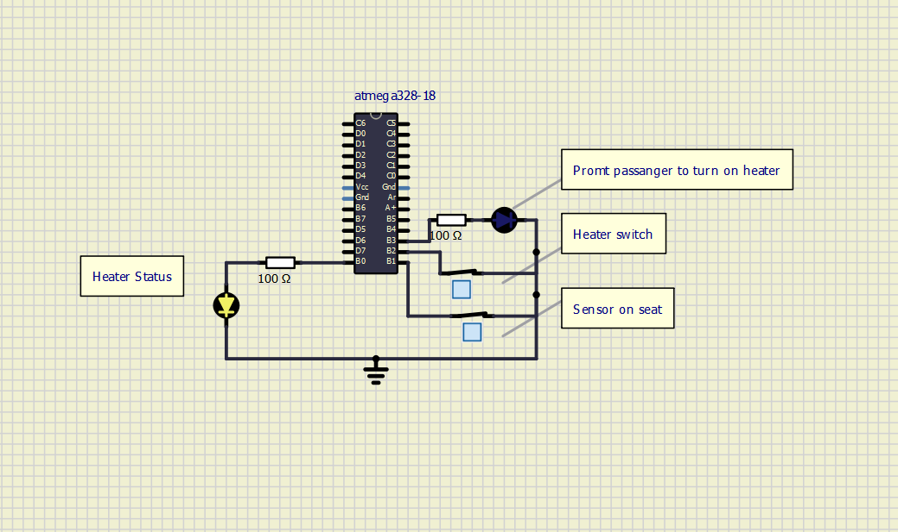
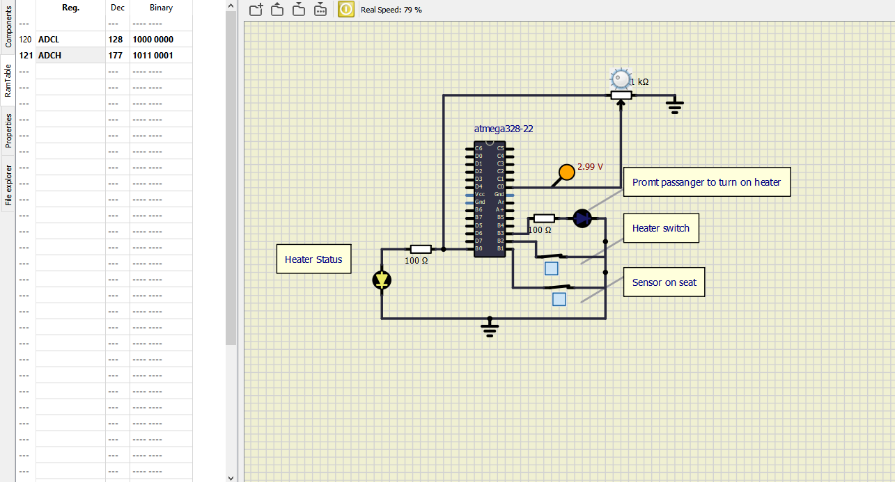
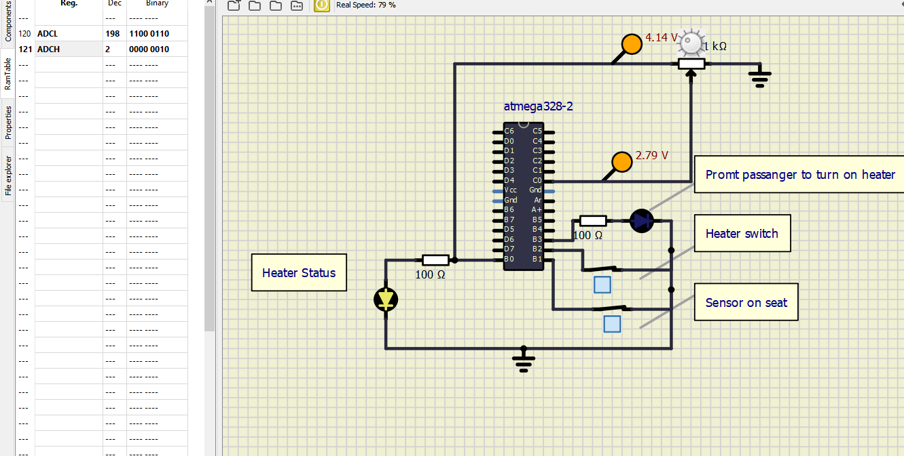
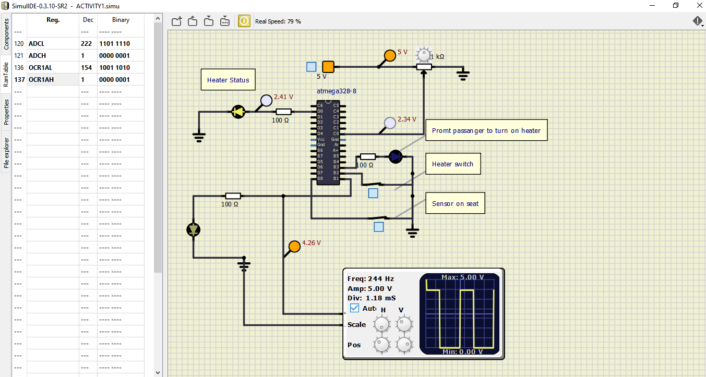
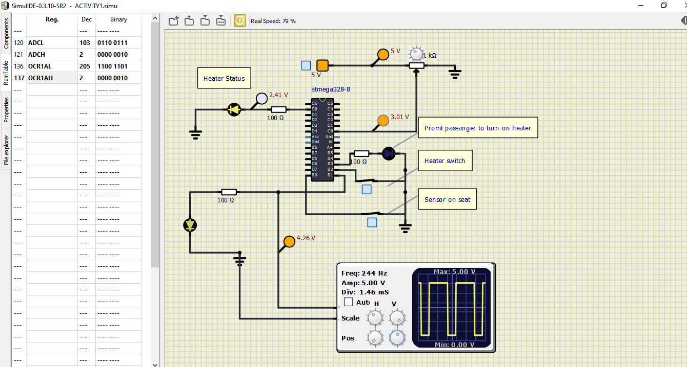
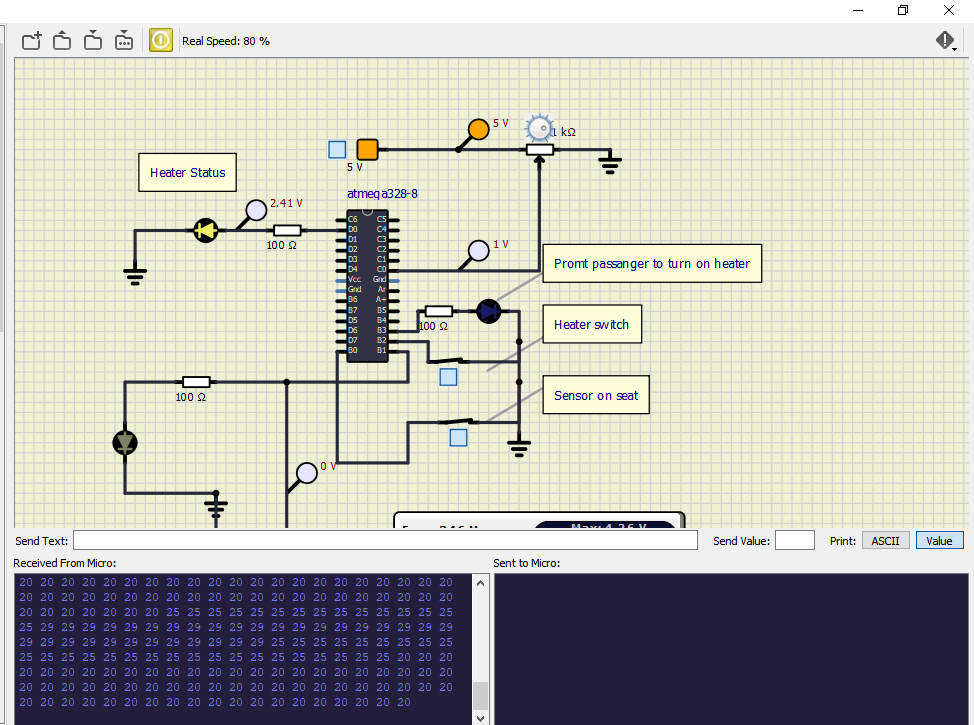
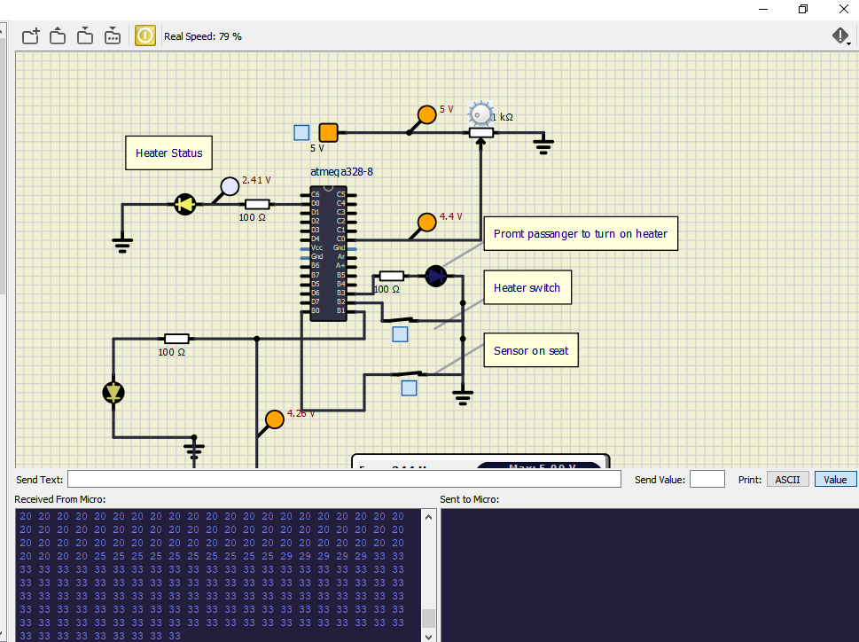

# CI and Code Quality

|Build|Cppcheck|Codacy|
|:--:|:--:|:--:|
||||

# Car Seat Heating Application
- This is the application for car seat heater where user can adjust the temperature value according to the need
## In Action
### Activity 1
                                            **_Activity 1 progress_**

|OFF|PROMT|ON|
|:--:|:--:|:--:|
||||

### Activity 2
**_Activity 2 progress_**

|2a|2b|
|:--:|:--:|
|||

### Activity 3
**_Activity 3 progress_**

|3a|3b|
|:--:|:--:|
|||

### Activity 4
 **_Activity 4 progress_**

|4a|4b|
|:--:|:--:|
|||

